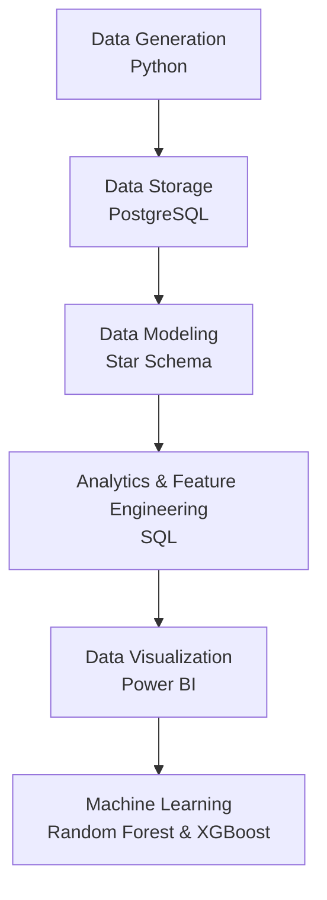
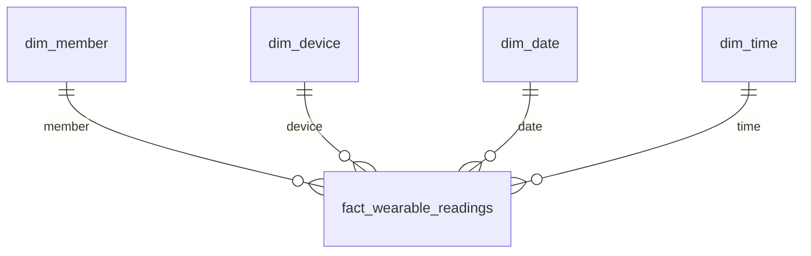
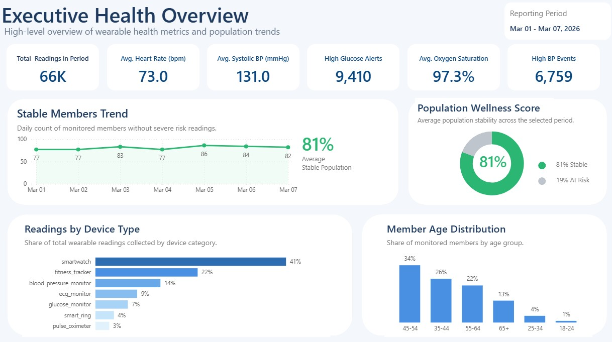
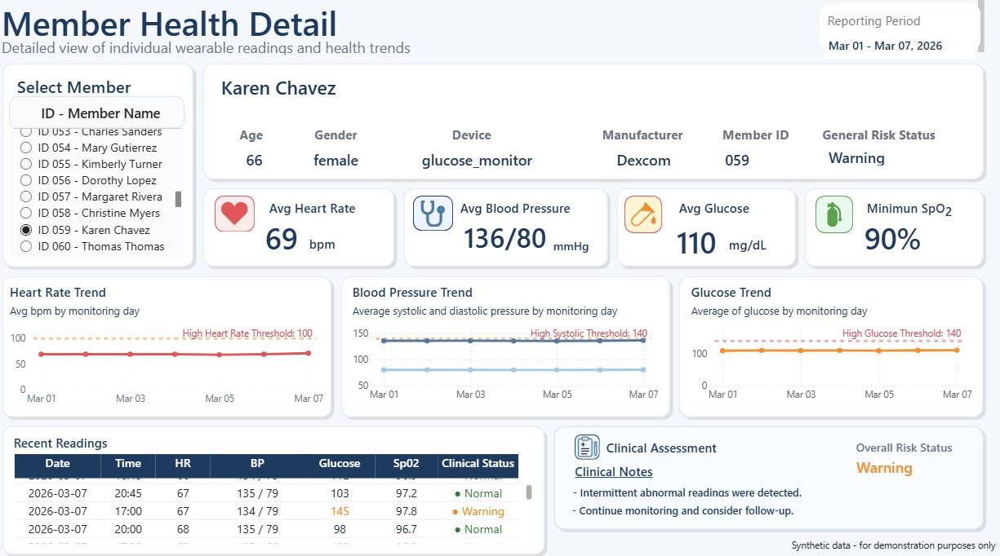
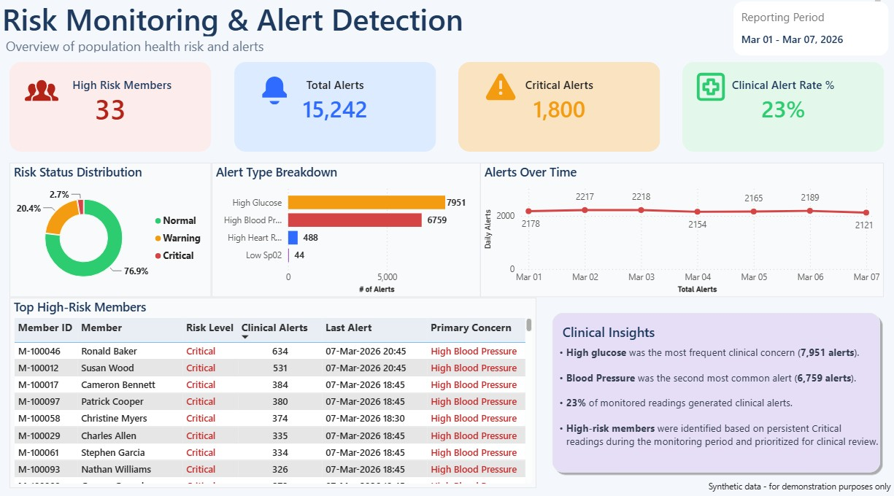
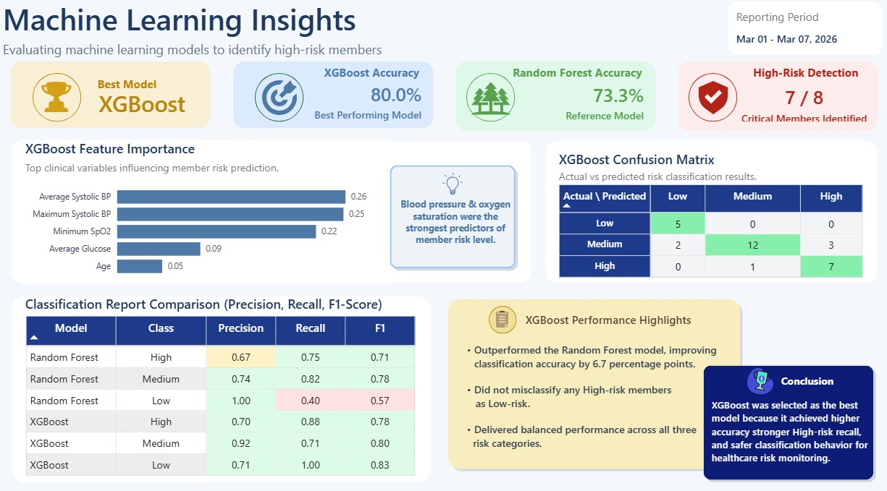

# Wearable Health Analytics & Risk Prediction

## Project Overview

**Wearable Health Analytics & Risk Prediction** is an end-to-end healthcare data
 analytics and machine learning project that simulates wearable-device health data and demonstrates how it can be transformed into actionable insights.

The project covers the complete analytics workflow, including synthetic data generation with Python, relational data storage in PostgreSQL, dimensional data modeling, SQL-based analytics feature engineering, interactive Power BI dashboards, and machine learning models for member risk classification.

The solution analyzes health metrics such as heart rate, blood pressure, glucose, and oxygen saturation (SpO<sub>2</sub>) to identify health patterns, monitor risk conditions, and classify members into risk levels.

> **Data Notice:** This project uses entirely **synthetic data created for demonstration and portfolio purposes.**  
> No real patient, member, or protected health information (PHI) is used.

## Project Objectives

The main objectives of this project are to:

- Simulate wearable health data for multiple members and devices.
- Design a relational database and a star schema for storing and analyzing health data.
- Analyze health metrics and identify abnormal or potentially high-risk readings using SQL.
- Build interactive Power BI dashboards for health monitoring, risk analysis, and member-level exploration.
- Engineer member-level health features for machine learning using SQL.
- Develop and compare machine learning models to classify members into Low, Medium, and High risk levels.

## Architecture / Workflow

The project follows an end-to-end analytics workflow, transforming synthetic wearable-device data into analytical insights, interactive dashboards, and machine learning predictions.




## Workflow Stages

**Data Generation** - Generate synthetic member, device, and wearable health data with Python.  
**Data Storage** - Load generated data into PostgreSQL.  
**Data Modeling** - Organize analytical data using a star schema.  
**Analytics & Feature Engineering** - Analyze health metrics and create member-level ML features with SQL.  
**Data Visualization** - Build interactive health and risk-monitoring dashboards in Power BI.  
**Machine Learning** - Train and compare Random Forest and XGBoost risk-classification models.


## Tech Stack
|Category | Technology |
|---|---|
| Programming | Python |
| Data Processing | pandas, NumPy |
| Database | PostgreSQL |
| Analytics | SQL |
| Machine Learning | scikit-learn (Random Forest), XGBoost |
| Visualization | Power BI |
| Version Control | Git, GitHub |

## Database and Star Schema

### Relational Database

The generated wearable health data are stored in PostgreSQL using four main relational tables:

- **members** - Member demographic information
- **devices** - Wearable device information
- **member_devices** - Member-to-device assignments with historical tracking.
- **wearable_readings** - Wearable health readings including heart rate, blood pressure, glucose, and SpO<sub>2</sub>.

The following Entity Relationship Diagram (ERD) shows the relationships among the main relational tables:


### Star Schema

A star schema was created to support analytical queries and Power BI reporting.



The central **fact_wearable_readings** table contains the health measurements and connects to four dimension tables:

- **dim_member** - Member attributes.
- **dim_device** - Device attributes.
- **dim_date** - Calendar attributes.
- **dim_time** - Time-of-day attributes.

## SQL Analytics / Feature Engineering

SQL was used to aggregate wearable health readings into member-level health metrics and engineer risk features for machine learning.

Key tasks included:

- Aggregating health metrics by member.
- Identifying abnormal heart rate, blood pressure, glucose and SpO<sub>2</sub> readings.
- Creating risk-point logic for individual health indicators.
- Combining health metrics and risk scores into member-level analytical views.
- Producing the final `member_ml_dataset.csv` file used to train and evaluate the machine learning models.

The feature-engineering pipeline was implemented through three SQL views:
`member_health_features` → `member_risk_points` → `member_ml_dataset`


## Power BI Dashboards

The Power BI report consists of four interactive pages covering health monitoring, member-level analytics, risk detection, and machine learning insights.

### 1. Executive Health Overview
 
  

Provides a high-level view of key metrics, trends, and device usage.

### 2. Member Health Detail

  

Enables member-level exploration of health metrics, risk status, and recent readings.

### 3. Risk Monitoring & Alert Detection

  

Highlights warning and critical readings, clinical alerts, and members requiring closer monitoring.

### 4. Machine Learning Insights

   

Compares model performance and presents classification results, confusion matrix, and feature importance.

## Machine Learning

### Methodology

The final member-level dataset was used to train and evaluate two classification models:

- **Random Forest**
- **XGBoost**

The models classify members into three risk levels: **Low, Medium, and High**.

Model performance was evaluated using accuracy, precision, recall, F1-score, and confusion matrices.

### Model Performance

|Model | Accuracy |
|---|---:|
| Random Forest | 73.3% |
| XGBoost | **80.0%** |

XGBoost achieved the highest classification accuracy, outperforming Random Forest by **6.7 percentage points**.

### Key Findings

- XGBoost correctly classified **24 of 30** members in the test set.
- **7 of 8 High-risk members** were correctly identified by XGBoost.
- XGBoost correctly classified **all 5 Low-risk members** in the test set.
- The strongest XGBoost predictors included **average systolic blood pressure**, **maximum systolic blood pressure**, **minimum SpO<sub>2</sub>**, and **average glucose**.

## Project Structure

```text
wearable-health-analytics/
├── dashboards/
│   └── power_bi/
│       └── screenshots/
│           ├── executive_health_overview.png
│           ├── member_health_detail.png
│           ├── risk_monitoring_and_alert_detection.png
│           └── machine_learning_insights.png
│
├── data/
│   ├── raw/
│   │   └── .gitkeep
│   ├── processed/
│   │   └── member_ml_dataset.csv
│   └── ml_results/
│       ├── rf_classification_report.csv
│       ├── rf_confusion_matrix.csv
│       ├── rf_feature_importance.csv
│       ├── rf_model_accuracy.csv
│       ├── xgboost_classification_report.csv
│       ├── xgboost_confusion_matrix.csv
│       ├── xgboost_feature_importance.csv
│       └── xgboost_model_accuracy.csv
│
├── docs/
│   └── er_diagram.png
│
├── python/
│   ├── data_generation/
│   │   ├── age_group_by_year.txt
│   │   ├── cities.txt
│   │   ├── devices_catalog.csv
│   │   ├── first_names.txt
│   │   ├── last_names.txt
│   │   ├── generate_members.py
│   │   ├── generate_devices.py
│   │   ├── generate_member_devices.py
│   │   └── generate_wearable_readings.py
│   │
│   └── machine_learning/
│       ├── train_random_forest.py
│       └── train_xgboost.py
│
├── sql/
│   ├── schema/
│   │   ├── create_tables.sql
│   │   └── create_star_schema.sql
│   ├── inserts/
│   │   ├── load_members_raw.sql
│   │   ├── load_devices_raw.sql
│   │   ├── load_member_devices_raw.sql
│   │   └── load_wearable_readings_raw.sql
│   └── analytics_queries/
│       └── create_member_ml_dataset_views.sql
│
├── .gitignore
└── README.md
```

## Development Environment & Architecture

This project was developed using a multi-environment architecture to simulate a real-world data analytics workflow.

The system uses separate virtual machines for Python data processing and machine learning, PostgreSQL data operations, and Power BI dashboard development.

### Environment Overview 

**VM1 - Data Processing & Machine Learning**
- Fedora Linux
- Python-based synthetic data generation
- Wearable health metrics simulation
- Data preparation and CSV exports
- Random Forest and XGBoost model environment
- Git and GitHub version control

**VM2 - Database & Analytics**
- CentOS Stream 9
- PostgreSQL 15.1
- Relational database and schema implementation
- Star schema implementation
- Data ingestion and integrity constraints
- SQL analytics and machine learning feature engineering

**VM3 - Data Visualization**
- Windows
- Power BI Desktop
- Data visualization and dashboard development
- DAX measures and calculated columns
- Interactive health, risk, and machine learning analysis

This separation creates an end-to-end workflow across data generation, database analytics, machine learning, and data visualization.


## Synthetic Data and Limitations

All data used in this project is **synthetically generated for portfolio purposes**. No real patient, member, or protected health information (PHI) is included.

The generated wearable data simulates patterns and variations in heart rate, blood pressure, glucose, and oxygen saturation (SpO<sub>2</sub>). The health thresholds, risk classifications, and alert logic used in the project are simplified analytical rules and should not be interpreted as clinical recommendations.

The machine learning models were trained on a synthetic dataset of 100 members. Therefore, the reported model performance demonstrates the machine learning workflow and model comparison rather than expected performance on real-world healthcare data.

## Business Insights

The analysis demonstrates how health data can support more proactive and risk-based healthcare management. By identifying members with stronger combinations of adverse health indicators, healthcare organizations could prioritize populations that may requiere closer monitoring or additional review rather than treating every member as having the same level of need.

Earlier identification of persistent or multiple abnormal health indicators may also create opportunities for preventive intervention.  This type of risk-based analysis could help care-management teams focus their attention and resources on population with greater potential need.

Although this project uses wearable-device data, wearable data represents only one possible source of health information.  The same analytical approach could incorporate historical or operational data such as claims, healthcare utilization, clinical records, or cost data.

The broader insight behind this project is how an organization can transform large amounts of historical or operational data into meaningful indicators, identify patterns and risk profiles, and present those insights in a way that supports better decision-making. 


## Future Improvements

Potential improvements for future versions of the project include:

- Expand the synthetic dataset to include a larger and more diverse member population and enable more robust validation.
- Implement continuous data ingestion from wearable devices or APIs to support near real-time health monitoring and automated risk detection.
- Extend the analytics framework to healthcare utilization and cost data, enabling analysis of preventive interventions, hospital visits, and potential opportunities to reduce avoidable healthcare costs.

## Copyright and Usage

© 2026 Ramon E. Gonzalez.  All rights reserved.

This project was independently developed by Ramon E. Gonzalez as a portfolio project.

The source code, synthetic datasets, database design, analytical methodology, machine learning implementation, dashboards, visualizations, and documentation contained in this repository may not be copied, reproduced, redistributed, or published as another person's work without permission.

This repository is publicly available for educational, demonstration, and portfolio-review purposes.
