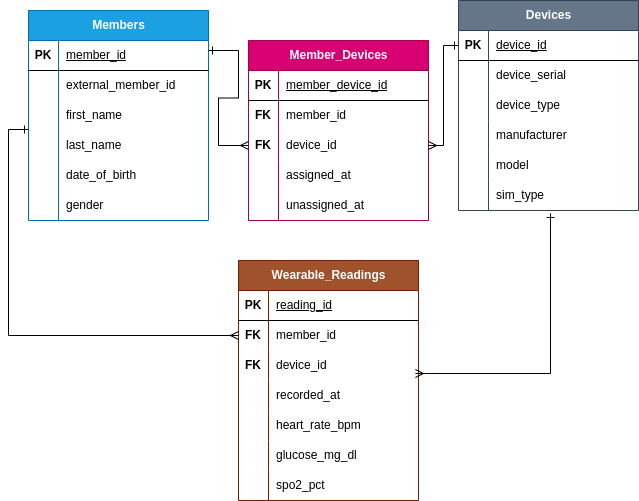

# Wearable Health Analytics

End-to-end wearable health data analytics project simulating wearable device data
used by health insurance and health tech companies.

# Project goals
- Simulate wearable health device data
- Store and analyze patient vitals
- Detect anomalies and risk conditions
- Generate automated health alerts
- Visualize insights in Tableau

# Tech Stack
- Python (pandas, numpy)
- PostgreSQL
- SQL
- Tableau
- Pandas
- Time-series analytics

# Project Structure
See repository folders for raw data, processed data, SQL schemas, and analytics queries.

# Database Schema

The following Entity Relationship Diagram (ERD) represents the logical data model for the Wearable Health Analytics project.

The schema is designed using crow's-foot notation and includes:

- one-to-many relationship
- a many-to-many relationship resolved via a bridge table
- full historical tracking of device assignments

# Development Environment & Architecture

This project was develop using a multi-environment architecture to closely simulate real-world data engineering workflows.

The system is intentionally separated into independent environments, reflecting how modern data platforms operate in production and cloud-based infrastructures.

## Environment Overview

** VM1 - Application & Data Processing Layer **
- Python-based data generation
- Synthetic wearable time-series data creation
- CSV export for ingestion
- Git version control

** VM2 - Database & Analytics Layer **
- PostgreSQL relational database
_ Schema design and implementation
- Foreign key and constraint enforcement
- Analytical SQL queries and validation

Both environments run on Linux virtual machines (KVM) and interact through GitHub, replicating the separation commonly found between application services and database system in production environments.
